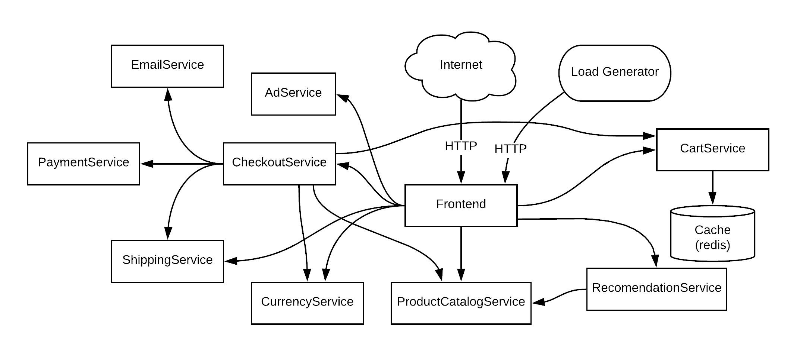
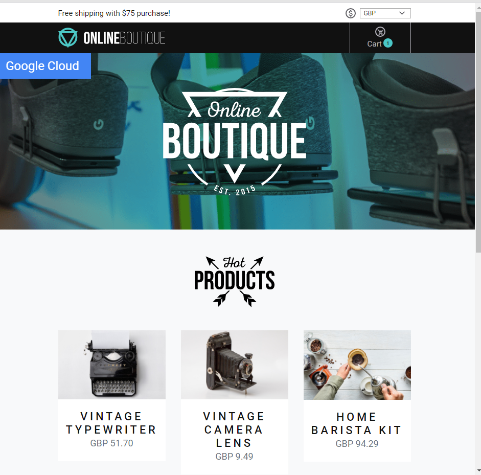

<p align="center">

</p>


**Online Boutique** is a cloud-native microservices demo application.
Online Boutique consists of a 10-tier microservices application. The application is a
web-based e-commerce app where users can browse items,
add them to the cart, and purchase them.

**Google uses this application to demonstrate use of technologies like
Kubernetes/GKE, Istio, Stackdriver, gRPC and OpenCensus**. This application
works on any Kubernetes cluster, as well as Google
Kubernetes Engine. It’s **easy to deploy with little to no configuration**.

> 👓**Note: We will deploy our application with ```skaffold```** 
> 
```./kubernetes-manifests```
> ⚠️ Kubernetes manifests provided in this directory are not directly deployable to a cluster. They are meant to be used with skaffold command to insert the correct image: tags. 

Looking for the old Hipster Shop frontend interface? Use the [manifests](https://github.com/GoogleCloudPlatform/microservices-demo/tree/v0.1.5/kubernetes-manifests) in release [v0.1.5](https://github.com/GoogleCloudPlatform/microservices-demo/releases/v0.1.5).

## Screenshots

| Home Page                                                                                                         | Checkout Screen                                                                                                    |
| ----------------------------------------------------------------------------------------------------------------- | ------------------------------------------------------------------------------------------------------------------ |
| [](./docs/img/online-boutique-frontend-1.png) | [](./docs/img/online-boutique-frontend-2.png) |

## Service Architecture

- **Online Boutique** is composed of many microservices written in different languages that talk to each other over gRPC.



| Service                                              | Language      | Description                                                                                                                       |
| ---------------------------------------------------- | ------------- | --------------------------------------------------------------------------------------------------------------------------------- |
| [frontend](./src/frontend)                           | Go            | Exposes an HTTP server to serve the website. Does not require signup/login and generates session IDs for all users automatically. |
| [cartservice](./src/cartservice)                     | C#            | Stores the items in the user's shopping cart in Redis and retrieves it.                                                           |
| [productcatalogservice](./src/productcatalogservice) | Go            | Provides the list of products from a JSON file and ability to search products and get individual products.                        |
| [currencyservice](./src/currencyservice)             | Node.js       | Converts one money amount to another currency. Uses real values fetched from European Central Bank. It's the highest QPS service. |
| [paymentservice](./src/paymentservice)               | Node.js       | Charges the given credit card info (mock) with the given amount and returns a transaction ID.                                     |
| [shippingservice](./src/shippingservice)             | Go            | Gives shipping cost estimates based on the shopping cart. Ships items to the given address (mock)                                 |
| [emailservice](./src/emailservice)                   | Python        | Sends users an order confirmation email (mock).                                                                                   |
| [checkoutservice](./src/checkoutservice)             | Go            | Retrieves user cart, prepares order and orchestrates the payment, shipping and the email notification.                            |
| [recommendationservice](./src/recommendationservice) | Python        | Recommends other products based on what's given in the cart.                                                                      |
| [adservice](./src/adservice)                         | Java          | Provides text ads based on given context words.                                                                                   |
| [loadgenerator](./src/loadgenerator)                 | Python/Locust | Continuously sends requests imitating realistic user shopping flows to the frontend.                                              |

## Features

- **[Kubernetes](https://kubernetes.io)/[GKE](https://cloud.google.com/kubernetes-engine/):**
  The app is designed to run on Kubernetes (both locally on "Docker for
  Desktop", as well as on the cloud with GKE).
- **[gRPC](https://grpc.io):** Microservices use a high volume of gRPC calls to
  communicate to each other.
- **[Istio](https://istio.io):** Application works on Istio service mesh.
- **[OpenCensus](https://opencensus.io/) Tracing:** Most services are
  instrumented using OpenCensus trace interceptors for gRPC/HTTP.
- **[Cloud Operations (Stackdriver)](https://cloud.google.com/products/operations):** Many services
  are instrumented with **Profiling**, **Tracing** and **Debugging**. In
  addition to these, using Istio enables features like Request/Response
  **Metrics** and **Context Graph** out of the box. When it is running out of
  Google Cloud, this code path remains inactive.
- **[Skaffold](https://skaffold.dev):** Application
  is deployed to Kubernetes with a single command using Skaffold.
- **Synthetic Load Generation:** The application demo comes with a background
  job that creates realistic usage patterns on the website using
  [Locust](https://locust.io/) load generator.

## Local Development

If you would like to contribute features or fixes to this app, see the [Development Guide](/docs/development-guide.md) on how to build this demo locally.

## Quickstart (GKE)

### **Gcloud** is the command-line tool for Google Cloud Platform. It comes pre-installed on Cloud Shell and supports tab-completion

- You can list the active account name with this command:
```
gcloud auth list
```
- You can list and choose the projects:
```
gcloud config list project
```
- or you can create a Google Cloud Platform project.
- Set the `PROJECT_ID` environment variable and ensure the Google Kubernetes Engine and Cloud Operations APIs are enabled.

```
# set the project Id 1:
PROJECT_ID="<your-project-id>"
# or set the project Id 2:
# export PROJECT_ID=$(gcloud info --format='value(config.project)')

gcloud services enable container.googleapis.com --project ${PROJECT_ID}
gcloud services enable monitoring.googleapis.com \
    cloudtrace.googleapis.com \
    clouddebugger.googleapis.com \
    cloudprofiler.googleapis.com \
    --project ${PROJECT_ID}
```

- Set the zone in gcloud
```
gcloud config set compute/zone us-west1-b
# or choose one of them, you want.
```

- Create a GKE cluster.
```
ZONE=us-west1-b
gcloud container clusters create onlineboutique \
    --project=${PROJECT_ID} --zone=${ZONE} \
    --machine-type=e2-standard-2 --num-nodes=4
```

**Note:** Connect to Google Kubernetes Engine cluster and validate that it's been created correctly.
```
gcloud container clusters list
```

- Once your cluster has RUNNING status, get the cluster credentials:
```
gcloud container clusters get-credentials shop-cluster --zone us-west1-b
```
- Verify that the nodes have been created:
```
kubectl get nodes
```

## 1. Deploy application with Skaffold

- Run the following to clone the repo:

```
git clone https://github.com/GoogleCloudPlatform/training-data-analyst
```
- Create a soft link to your working directory:
```
ln -s ~/training-data-analyst/blogs/microservices-demo-1 ~/microservices-demo-1

```
- Download and install skaffold:
```
curl -Lo skaffold https://storage.googleapis.com/skaffold/releases/latest/skaffold-linux-amd64 && chmod +x skaffold && sudo mv skaffold /usr/local/bin
```
Install the app using skaffold:
```
cd microservices-demo-1
skaffold run
```
- Confirm everything is running correctly:
```
kubectl get pods
```

- Get the external IP of the application:
```
export EXTERNAL_IP=$(kubectl get service frontend-external | awk 'BEGIN { cnt=0; } { cnt+=1; if (cnt > 1) print $4; }')
```


- Finally, confirm that the app is up and running:
```
curl -o /dev/null -s -w "%{http_code}\n"  http://$EXTERNAL_IP

# Your confirmation will look like this:200
```

- Download the source and put the code in the Cloud Source Repo: = **"cat setup_csr.sh"**
```
#!/bin/bash
# Copyright 2019 Google Inc. All rights reserved.
#
# Licensed under the Apache License, Version 2.0 (the "License");
# you may not use this file except in compliance with the License.
# You may obtain a copy of the License at
#
#     http://www.apache.org/licenses/LICENSE-2.0
#
# Unless required by applicable law or agreed to in writing, software
# distributed under the License is distributed on an "AS IS" BASIS,
# WITHOUT WARRANTIES OR CONDITIONS OF ANY KIND, either express or implied.
# See the License for the specific language governing permissions and
# limitations under the License.

export CSR_REPO_NAME=apm-qwiklabs-demo
export MASTER_BRANCH=master
date

# Create the temporary dirs for the code
mkdir -p tmp/master

cd tmp/master
pwd
git clone https://github.com/blipzimmerman/microservices-demo-1
cd microservices-demo-1
git remote add apm-demo https://source.developers.google.com/p/$DEVSHELL_PROJECT_ID/r/$CSR_REPO_NAME
git push apm-demo master

# Clean everything up
cd ../../../
rm -rf tmp/master/*
rm -rf tmp/master/.*
rm -rf tmp/error/*
rm -rf tmp/error/.*
rmdir tmp/error tmp/master tmp


```
- Run the code
```
./setup_csr.sh
```
[


